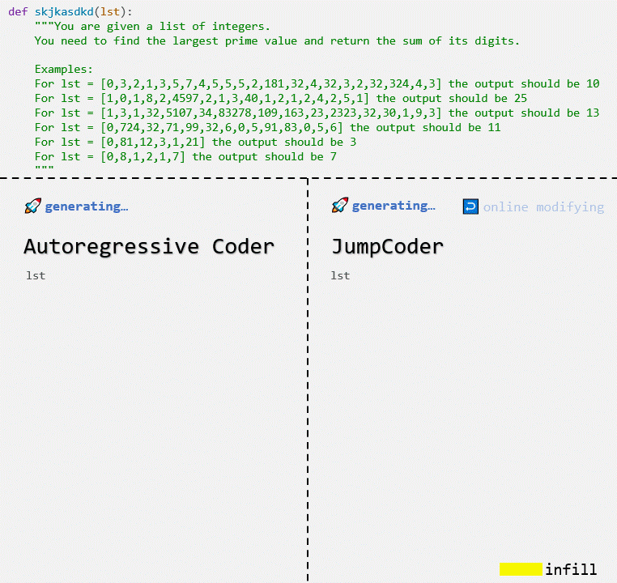
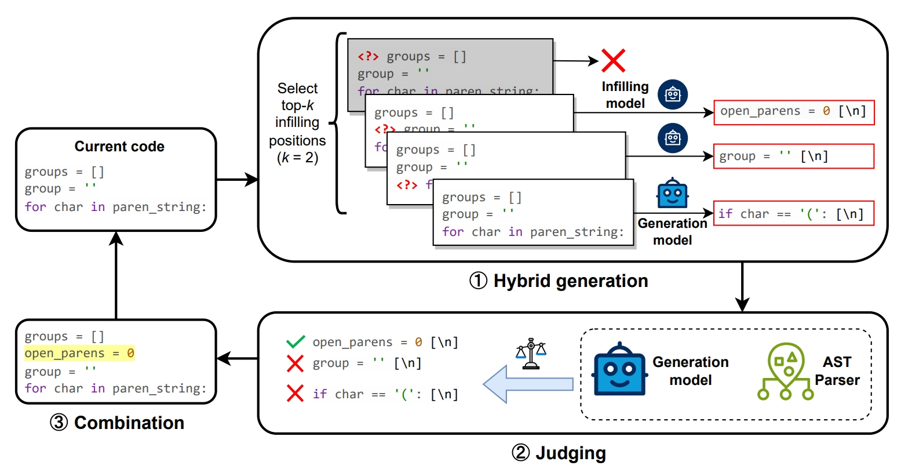
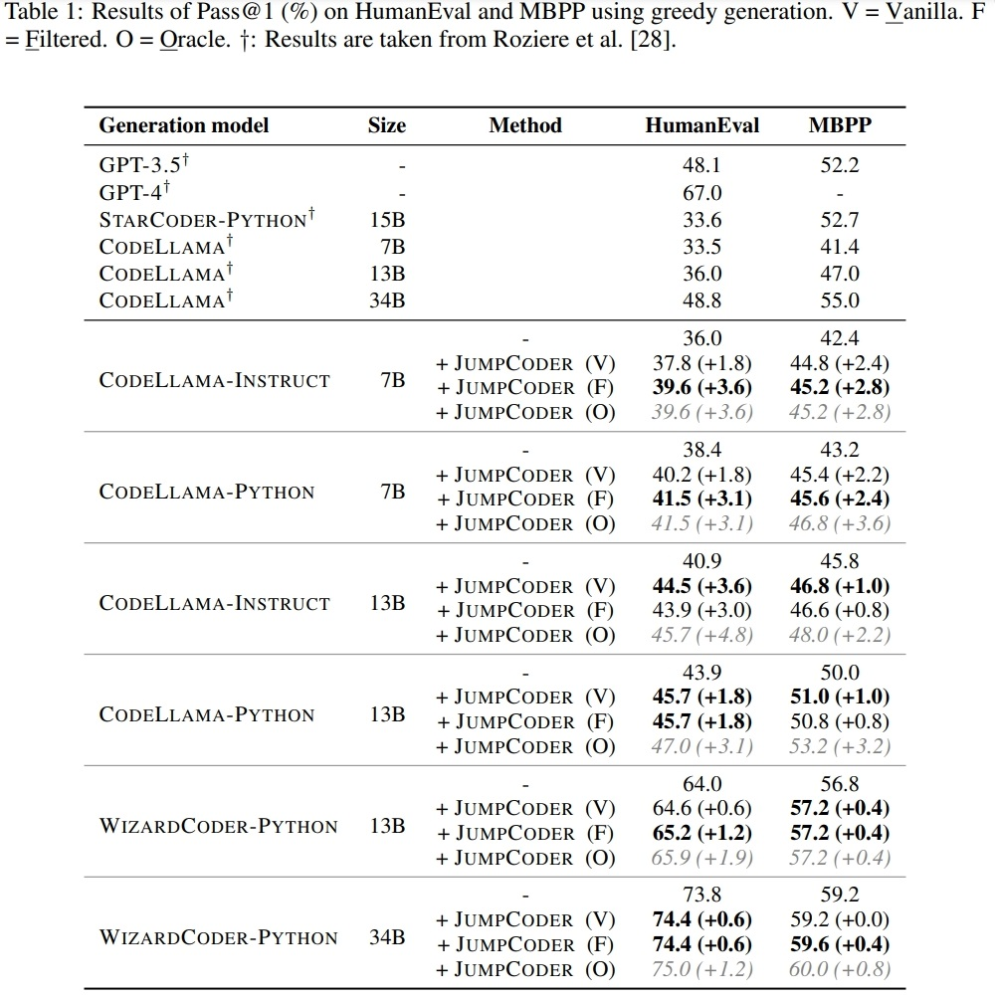
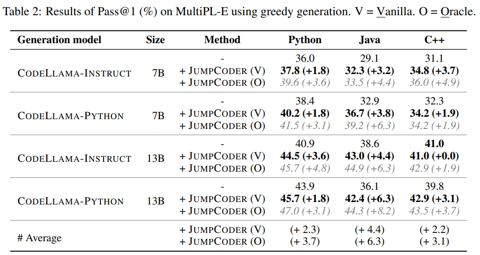

# JumpCoder

<p align="center">
    📃&nbsp;<a href="https://arxiv.org/abs/2401.07870">Paper</a>
    | 🔍&nbsp;<a href="#-about">About</a>
    | 🔨&nbsp;<a href="#-setup">Setup</a>
    | 🚀&nbsp;<a href="#-quick-start">Quick Start</a>
    | 📊&nbsp;<a href="#-evaluation">Evaluation</a>
    | 🔗&nbsp;<a href="#-citation">Citation</a>
</p>


<p align="center">
  
</p>


## 🔍 About

This repository contains the implementation of our paper [*JumpCoder: Go Beyond Autoregressive Coder via Online Modification*](https://arxiv.org/abs/2401.07870). JumpCoder is a model-agnostic framework, designed to enhance code large language models (LLMs) through online modification and non-sequential code generation. It does not require any fine-tuning or human intervention.

**Why JumpCoder?** Traditional code LLMs generate code in a linear, irreversible sequence. This can lead to errors accumulating over time, as they can't jump back and correct the previous missing statements like a human. JumpCoder addresses this issue and improves the quality of the generated code.

**How it Works:** JumpCoder can insert new code into currently generated code on-the-fly. It uses an auxiliary *infilling model* that operates alongside the code LLM, allowing for online modifications.




## 🔨 Setup

> [!IMPORTANT]
> JumpCoder requires separate environments for the infilling and generation models, as they might need different versions of libraries like `transformers`. These models communicate through socket connections. Be sure to set up each model in its appropriate environment.

For example, if using CodeLlama, ensure you have `transformers` version `4.33.0` or newer. Refer to [official instructions](https://huggingface.co/codellama/CodeLlama-7b-Instruct-hf) for setup.

For WizardCoder, use `transformers==4.31.0`. Setup instructions can be found [here](https://github.com/nlpxucan/WizardLM/tree/main/WizardCoder).


## 🚀 Quick Start

To use JumpCoder, you'll need an infilling model. We recommend [CodeLlama-Instruct-7B](https://huggingface.co/codellama/CodeLlama-7b-Instruct-hf), which performs well in our experiments. 

```bash
# in the CodeLlama environment
python run_llm_server.py \
    --checkpoint codellama/CodeLlama-7b-Instruct-hf \
    --port 12345 \
    --device cuda:0
```

Next, launch the generation model. For example, using `CodeLlama-Instruct-7B` as well:

```bash
# in the CodeLlama environment
python run_llm_server.py \
    --checkpoint codellama/CodeLlama-7b-Instruct-hf \
    --port 12346 \
    --device cuda:1
```

To test the example, run:

```bash
python example.py --port_infilling 12345 --port_generation 12346
```

You can observe both the standard autoregression output and our JumpCoder's output, which includes dynamic code infilling.

<details>
  <summary>Click here for the example output</summary>

```python
# Generated from Autoregressive Coder
def minSubArraySum(nums):
    """
    Given an array of integers nums, find the minimum sum of any non-empty sub-array
    of nums.
    Example
    minSubArraySum([2, 3, 4, 1, 2, 4]) == 1
    minSubArraySum([-1, -2, -3]) == -6
    """
    if not nums:
        return 0
    min_sum = sum(nums)
    for i in range(len(nums)):
        for j in range(i, len(nums)):
            if sum(nums[i:j]) < min_sum:
                min_sum = sum(nums[i:j])
    return min_sum

# Generated from JumpCoder
def minSubArraySum(nums):
    """
    Given an array of integers nums, find the minimum sum of any non-empty sub-array
    of nums.
    Example
    minSubArraySum([2, 3, 4, 1, 2, 4]) == 1
    minSubArraySum([-1, -2, -3]) == -6
    """
    if not nums:
        return 0
    min_sum = sum(nums)
    for i in range(len(nums)):
        curr_sum = 0  # infill
        for j in range(i, len(nums)):
            curr_sum += nums[j]
            if curr_sum < min_sum:
                min_sum = curr_sum
    return min_sum
```
</details>


## 📊 Evaluation

We tested JumpCoder using several CodeLlama and WizardCoder variants on HumanEval and MBPP.



To demonstrate its versatility in different programming languages, we also evaluated it using the MultiPL-E benchmark.



You can find our test scripts in the `scripts/` directory. Below is an example command for evaluating CodeLlama-7B-Instruct on HumanEval. Adjust the parameters as needed (model path, dataset path, etc.).

```bash
# Launch the generation server
bash scripts/evaluate_cl_humaneval.sh --build-generation-server

# In a new terminal, launch the infilling server
bash scripts/evaluate_cl_humaneval.sh --build-infilling-server

# Finally, run the evaluation
bash scripts/evaluate_cl_humaneval.sh --evaluate
```

> [!TIP]
> When testing WizardCoder, make sure to execute `--build-generation-server` and `--build-infilling-server` in their respective Python environments as per their specific requirements.

## 🔗 Citation

```bibtex
@misc{chen2024jumpcoder,
      title={JumpCoder: Go Beyond Autoregressive Coder via Online Modification}, 
      author={Mouxiang Chen and Hao Tian and Zhongxin Liu and Xiaoxue Ren and Jianling Sun},
      year={2024},
      eprint={2401.07870},
      archivePrefix={arXiv},
      primaryClass={cs.CL}
}
```


